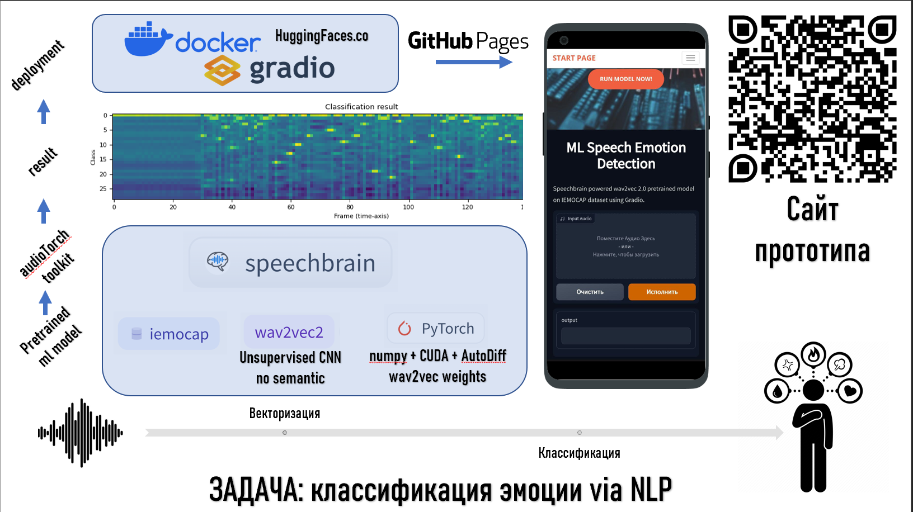

---
tags:
- audio-classification
- speechbrain
- Emotion
- Recognition
- wav2vec2
- pytorch
datasets:
- iemocap
metrics:
- Accuracy on test on IEMOCAP is 75%
---
WORKING PROTOTYPE -> [https://immelstorun.github.io/speech_emo_recognition/](https://immelstorun.github.io/speech_emo_recognition/)
# MIPT prototype Emotion Recognition with wav2vec2 base on IEMOCAP

`MIPT students prototype for speech emotion recognition using Machine Learning pretrained wav2vec model on IEMOCAP dataset powered by speechbrain toolkit`

<p align="center">
  
</p>

Шаги реализации проекта

1.	Настройка и интеграция предобученной модели wav2vec2 из базы предобученных моделей от Speechbrain. [Модель](https://huggingface.co/speechbrain/emotion-recognition-wav2vec2-IEMOCAP)
2.	Создание простого пользовательского интерфейса для загрузки и воспроизведения аудиозаписей на интерфейсе Gradio
3.	Реализация функции классификации эмоций на основе загруженных аудио, развернув экземпляр в HuggingFace.co [Контейнер с работающим приложением](https://huggingface.co/spaces/immelstorun/speech_emotion_detection)
4.	Организация возвращения результатов классификации пользователю.
5.	Подготовка демонстрационного стенда с возможностью тестирования системы через Github.io [Перейти на сайт прототипа](https://immelstorun.github.io/speech_emo_recognition/)

### Быстрый запуск в Google Colab (описание с туториала speechbrain)

An external `py_module_file=custom.py` is used as an external Predictor class into this repos. We use `foreign_class` function from `speechbrain.pretrained.interfaces` that allow you to load you custom model. 

```python
!pip install speechbrain
from speechbrain.pretrained.interfaces import foreign_class
classifier = foreign_class(source="speechbrain/emotion-recognition-wav2vec2-IEMOCAP", pymodule_file="custom_interface.py", classname="CustomEncoderWav2vec2Classifier")
out_prob, score, index, text_lab = classifier.classify_file("speechbrain/emotion-recognition-wav2vec2-IEMOCAP/anger.wav")
print(text_lab)
```
The prediction tensor will contain a tuple of (embedding, id_class, label_name).

Tutorials and learn more about
[SpeechBrain](https://speechbrain.github.io).

Training results (models, logs, etc) [here](https://drive.google.com/drive/folders/15dKQetLuAhSyg4sNOtbSDnuxFdEeU4zQ?usp=sharing).
